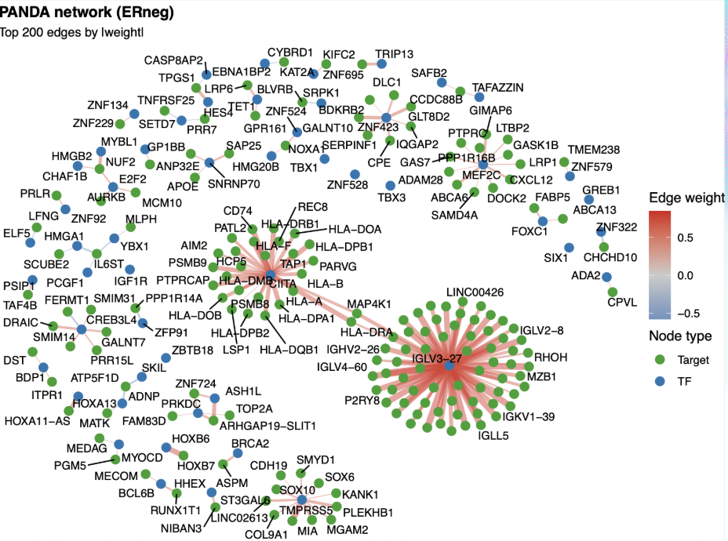
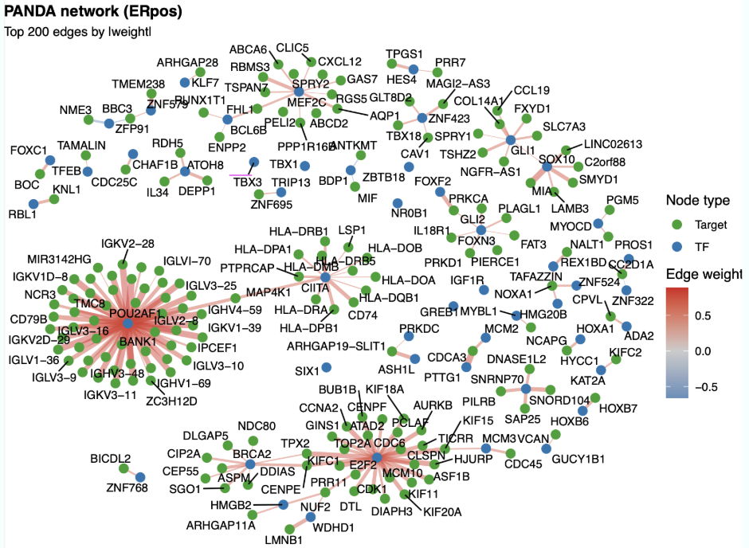

```{r setup, include=FALSE}
knitr::opts_chunk$set(echo = TRUE)
```

# BST 280 Final Project Group Report

## Research Question: BRCA: How do network structures differ across ER subtypes? A comprehensive analysis

#### Waverly Shi, Irene Zhang, Qiayi Zha, Cuiqiyun Yang, Siheng Tao

#### December 19, 2025

### Introduction

#### Background on BRCA

BRCA (BReast CAncer), which includes BRCA1 and BRCA2, are two different tumor suppressor genes that produce proteins involved in DNA repair.1 Individuals with a pathogenic variant of one of these BRCA genes or a mutation in the BRCA genes are at increased risk of several cancers, most notably, breast cancer. \#### Background on ER+ and ER- Breast Cancer Mutations in the BRCA genes are linked to specific breast cancer subtypes, often classified by estrogen receptor (ER) status. ER-positive (ER+) tumors express estrogen receptors, while ER-negative (ER–) tumors do not.1,2

ER-positive (ER+) breast cancer is the most common subtype (70-80%) and is frequently associated with mutations in the BRCA2 gene.3 Major risk factors relate to increased lifetime estrogen exposure.4 Because the tumors express estrogen receptors, treatment often involves hormone therapy. ER-negative (ER-) breast cancer is generally more aggressive, particularly in triple-negative (ER-, HER-, PR-). 70-80% of all ER- cancers are linked to BRCA1 mutations.2 Key risk factors include overweight and obesity, particularly premenopause, family history, BRCA1 mutations, parity at young age, and lack of breastfeeding.4 Since ER- tumor cells lack estrogen receptors, they are generally treated with chemotherapy, immunotherapy, or targeted therapy.

### Methods

#### 1. Setup

```{r}
#!/usr/bin/env Rscript
# TCGA-BRCA ER+ vs ER− RNA-seq analysis
set.seed(20250219)
options(stringsAsFactors = FALSE)

# -------------------- Setup --------------------
required_pkgs <- c(
  "DESeq2", "ggplot2", "ggrepel", "dplyr", "tibble", "readr", "tidyr",
  "pheatmap", "fgsea", "msigdbr", "org.Hs.eg.db", "AnnotationDbi", "dplyr",
  "data.table", "BiocParallel", "matrixStats", "Rtsne",
  "ggraph", "tidygraph", "igraph"
)

optional_pkgs <- c("netZooR", "apeglm", "ashr", "clusterProfiler")

install_if_missing <- function(pkgs, stop_on_fail = TRUE) {
  for (p in pkgs) {
    if (!requireNamespace(p, quietly = TRUE)) {
      message("Package ", p, " not found; attempting install (requires internet).")
      tryCatch({
        if (!requireNamespace("BiocManager", quietly = TRUE)) {
          install.packages("BiocManager", repos = "https://cloud.r-project.org")
        }
        BiocManager::install(p, ask = FALSE, update = FALSE)
        if (!requireNamespace(p, quietly = TRUE) && identical(p, "netZooR")) {
          # Bioc release may not yet have netZooR for this R/Bioc version; try GitHub
          message("netZooR not found in current Bioconductor release; trying GitHub netZoo/netZooR.")
          if (!requireNamespace("remotes", quietly = TRUE)) {
            install.packages("remotes", repos = "https://cloud.r-project.org")
          }
          remotes::install_github("netZoo/netZooR", upgrade = "never", dependencies = FALSE)
        }
      }, error = function(e) {
        if (stop_on_fail) {
          stop("Package ", p, " is required but could not be installed automatically. ",
               "Install it manually (internet needed) and re-run. Details: ", e$message)
        } else {
          warning("Optional package ", p, " could not be installed automatically. ",
                  "Falling back to no-", p, " mode. Details: ", e$message)
        }
      })
    }
    if (requireNamespace(p, quietly = TRUE)) {
      library(p, character.only = TRUE)
    } else if (stop_on_fail) {
      stop("Package ", p, " is required but still not available after install attempt.")
    } else {
      message("Skipping attach for optional package ", p, " (not available).")
    }
  }
}
install_if_missing(required_pkgs)
install_if_missing(optional_pkgs, stop_on_fail = FALSE)

has_netZooR <- requireNamespace("netZooR", quietly = TRUE)
if (!has_netZooR) {
  message("netZooR not installed; PANDA will fall back to correlation-based weights.")
}
has_clusterProfiler <- requireNamespace("clusterProfiler", quietly = TRUE)
if (!has_clusterProfiler) {
  message("clusterProfiler not installed; TF-target enrichment will be skipped. Install manually to enable.")
}

workers <- max(1, parallel::detectCores() - 1)
bp_param <- BiocParallel::MulticoreParam(workers = workers)
use_parallel <- workers > 1
fgsea_nperm <- 2000  # reduce permutations for speed
max_network_genes <- 5000  # cap genes passed into PANDA/correlation
message("Parallel workers for DE/network: ", workers)

er_dir <- file.path("results", "er_analysis")
er_fig_dir <- file.path(er_dir, "figures")
er_tbl_dir <- file.path(er_dir, "tables")
dir.create(er_fig_dir, recursive = TRUE, showWarnings = FALSE)
dir.create(er_tbl_dir, recursive = TRUE, showWarnings = FALSE)
pca_log <- file.path(er_tbl_dir, "pca_diagnostics.txt")
if (file.exists(pca_log)) file.remove(pca_log)

# -------------------- Helpers --------------------
strip_version <- function(x) sub("\\..*$", "", x)
clean_er <- function(x) {
  y <- toupper(trimws(x))
  y <- ifelse(grepl("POS", y), "ERpos",
              ifelse(grepl("NEG", y), "ERneg", NA))
  y
}
write_placeholder_pdf <- function(path, message_line, width = 6, height = 4) {
  grDevices::pdf(path, width = width, height = height, useDingbats = FALSE)
  grid::grid.newpage()
  grid::grid.text(message_line)
  grDevices::dev.off()
}

```

#### 2. Preparation: Load and Align Data
Gene expression and metadata were loaded from the TCGA-BRCA RDS object, which exist as a SummarizedExperiment object, and the RNA-seq count matrix and clinical sample metadata were extracted accordingly.

To ensure valid downstream analysis, the code aligned samples across expression and metadata by intersecting identifiers. Samples present in both datasets were retained, while mismatched samples were excluded. A minimum overlap threshold was enforced to prevent analyses on insufficient sample sizes.

```{r}

# -------------------- Load data --------------------
obj <- readRDS(file.path("data", "tcga_brca.rds"))

if (inherits(obj, "SummarizedExperiment")) {
  expr_mat <- as.matrix(SummarizedExperiment::assay(obj))
  meta <- as.data.frame(SummarizedExperiment::colData(obj))
} else if (is.list(obj)) {
  candidate_expr <- obj[intersect(names(obj), c("expression", "expr", "counts", "assay", "data"))]
  candidate_meta <- obj[intersect(names(obj), c("colData", "metadata", "clinical", "pheno", "samples"))]
  expr_mat <- if (length(candidate_expr) > 0) as.matrix(candidate_expr[[1]]) else stop("No expression matrix found.")
  meta <- if (length(candidate_meta) > 0) as.data.frame(candidate_meta[[1]]) else stop("No metadata found.")
} else if (is.matrix(obj) || is.data.frame(obj)) {
  expr_mat <- as.matrix(obj)
  meta <- stop("Metadata missing; cannot proceed without clinical data.")
} else {
  stop("Unsupported data structure in RDS.")
}

# Align samples
common_samples <- intersect(colnames(expr_mat), rownames(meta))
if (length(common_samples) < 4) stop("Too few overlapping samples.")
expr_mat <- expr_mat[, common_samples, drop = FALSE]
meta <- meta[common_samples, , drop = FALSE]
```

#### 3. ER Status Filtering
ER status was extracted from the clinical metadata based on the column "tcga.xml_breast_carcinoma_estrogen_receptor_status". The distribution of raw labels was inspected to verify data integrity.

Only samples annotated definitively as “Positive” or “Negative” were retained; ambiguous or missing ER values were excluded. ER labels were recoded into analytical groups:

ERpos (estrogen receptor–positive)

ERneg (estrogen receptor–negative)

```{r}
# -------------------- ER status filtering --------------------

er_col <- "tcga.xml_breast_carcinoma_estrogen_receptor_status"

if (!er_col %in% colnames(meta)) {
  stop(paste0("ER status column '", er_col, "' not found in metadata."))
}

# Inspect raw ER labels (useful for sanity check)
cat("Raw ER status distribution:\n")
print(table(meta[[er_col]], useNA = "ifany"))

# Keep only clear ER-positive / ER-negative samples; drop NA labels completely
keep <- !is.na(meta[[er_col]]) & meta[[er_col]] %in% c("Positive", "Negative")
if (sum(keep) < 2) {
  stop("Fewer than two samples have clear ER status (Positive/Negative).")
}

expr_mat <- expr_mat[, keep, drop = FALSE]
meta <- meta[keep, , drop = FALSE]

# Recode ER status
meta$ER_status <- ifelse(
  meta[[er_col]] == "Positive",
  "ERpos",
  "ERneg"
)

meta$ER_status <- factor(meta$ER_status, levels = c("ERneg", "ERpos"))
if (anyNA(meta$ER_status)) {
  stop("Detected NA ER_status entries after filtering; check metadata format.")
}
meta$ER_status <- droplevels(meta$ER_status)
if (!setequal(levels(meta$ER_status), c("ERneg", "ERpos"))) {
  stop("After filtering, ER_status must contain both ERneg and ERpos samples.")
}

cat("Samples retained after ER filter:", ncol(expr_mat), "\n")


```

#### 4. Gene Filtering and DESeq2 Normalization
To improve robustness and reduce noise, gene identifiers were cleaned and duplicate or empty gene names were removed. A low-expression filter was also applied to exclude genes with insufficient representation across samples. Only genes with ≥10 counts in at least 20% of samples were kept. This filtering step reduces false positives and increases statistical power.

A DESeq2 dataset object was constructed using filtered gene counts and ER status as the design formula (\~ ER_status). DESeq2’s modeling pipeline was executed to estimate size factors, dispersions, and fit negative binomial models. Parallel computing was used when available to accelerate fitting. Variance-stabilizing transformation (VST) was applied to the normalized counts to produce homoscedastic expression values suitable for visualization and clustering. The resulting normalized expression matrix was used for all following exploratory analyses.

```{r}
# -------------------- Gene filtering --------------------
rownames(expr_mat) <- strip_version(rownames(expr_mat))
expr_mat <- expr_mat[!duplicated(rownames(expr_mat)) & rownames(expr_mat) != "", , drop = FALSE]
keep_genes <- rowSums(expr_mat >= 10) >= ceiling(0.2 * ncol(expr_mat))
expr_filt <- expr_mat[keep_genes, ]
cat("Genes retained after low-expression filter:", nrow(expr_filt), "\n")

# Remove genes lacking a SYMBOL annotation
symbol_map_expr <- AnnotationDbi::select(
  org.Hs.eg.db,
  keys = rownames(expr_filt),
  columns = c("SYMBOL"),
  keytype = "ENSEMBL"
)
symbol_map_expr <- symbol_map_expr[!duplicated(symbol_map_expr$ENSEMBL), , drop = FALSE]
valid_symbol_ids <- symbol_map_expr$ENSEMBL[!is.na(symbol_map_expr$SYMBOL) & symbol_map_expr$SYMBOL != ""]
expr_filt <- expr_filt[rownames(expr_filt) %in% valid_symbol_ids, , drop = FALSE]
cat("Genes retained after removing entries without SYMBOL:", nrow(expr_filt), "\n")
if (nrow(expr_filt) == 0) {
  stop("No genes remain after filtering for SYMBOL annotations.")
}

```

#### 5. EDA: PCA and t-SNE on variable-gene subsets
Principal component analysis (PCA) and t-SNE were applied to the VST-normalized matrix to visualize separation of ER groups. Plots are generated for all genes and the top variable subsets (2,000 and 500 genes), with ER-specific colors/labels for readability.


```{r}

# -------------------- DESeq2 setup & normalization --------------------
dds <- DESeq2::DESeqDataSetFromMatrix(countData = expr_filt, colData = meta, design = ~ ER_status)

# More conservative fitting: don’t replace outliers (avoids artificially huge effects)
dds <- DESeq2::DESeq(
  dds,
  parallel = use_parallel,
  BPPARAM = bp_param,
  minReplicatesForReplace = Inf  # NEW
)

vsd <- DESeq2::vst(dds, blind = FALSE)
norm_mat <- SummarizedExperiment::assay(vsd)

# Map normalized matrix rownames (Ensembl) to gene symbols for plotting and clustering
map_norm <- AnnotationDbi::select(
  org.Hs.eg.db,
  keys = rownames(norm_mat),
  columns = c("SYMBOL"),
  keytype = "ENSEMBL"
)
map_norm <- map_norm[!duplicated(map_norm$ENSEMBL), , drop = FALSE]
sym_vec <- setNames(map_norm$SYMBOL, map_norm$ENSEMBL)
sym_lookup <- sym_vec[rownames(norm_mat)]
num_symbol_na <- sum(is.na(sym_lookup) | sym_lookup == "")
cat("Rows lacking a mapped symbol:", num_symbol_na, "\n")
has_symbol <- !is.na(sym_lookup) & sym_lookup != ""
if (sum(has_symbol) == 0) {
  stop("No genes with valid SYMBOL IDs remain after filtering.")
}
if (sum(!has_symbol) > 0) {
  message("Filtering out ", sum(!has_symbol), " genes lacking SYMBOL annotations from normalized matrix.")
}
norm_mat_sym <- norm_mat[has_symbol, , drop = FALSE]
rownames(norm_mat_sym) <- sym_lookup[has_symbol]
rownames_norm_sym <- rownames(norm_mat_sym)
symbol_map_df <- data.frame(
  ensembl = rownames(norm_mat)[has_symbol],
  symbol = sym_lookup[has_symbol],
  stringsAsFactors = FALSE
)
readr::write_tsv(symbol_map_df, file.path(er_tbl_dir, "ensembl_to_symbol_map.tsv"))

# -------------------- PCA + t-SNE (replacement block) --------------------
# Assumes you already have:
#   norm_mat_sym  (genes x samples, VST normalized, rownames = gene symbols)
#   meta          (rows = samples, meta$ER_status factor with levels c("ERneg","ERpos"))
#   er_fig_dir, er_tbl_dir already defined

# (Optional) for t-SNE
if (!requireNamespace("Rtsne", quietly = TRUE)) {
  stop("Package 'Rtsne' is required for t-SNE. Install it via: install.packages('Rtsne')")
}

# Pretty labels & palette
meta$ER_label <- factor(
  meta$ER_status,
  levels = c("ERneg", "ERpos"),
  labels = c("ER−", "ER+")
)

er_pal <- c("ER−" = "#E76F51", "ER+" = "#2A9D8F")

# Helper: pick top variable genes
select_top_var_genes <- function(mat, top_n = 2000) {
  if (is.na(top_n) || top_n <= 0 || nrow(mat) <= top_n) return(mat)
  v <- matrixStats::rowVars(mat, na.rm = TRUE)
  idx <- order(v, decreasing = TRUE)[seq_len(min(top_n, length(v)))]
  mat[idx, , drop = FALSE]
}

# -------------------- PCA --------------------
make_pca_plot <- function(mat, meta, prefix = "pca", top_n = NA) {
  mat_use <- if (is.na(top_n)) mat else select_top_var_genes(mat, top_n = top_n)
  tag <- if (is.na(top_n)) paste0(prefix, "_all") else paste0(prefix, "_top", top_n)
  
  if (nrow(mat_use) < 3 || ncol(mat_use) < 3) {
    message("Skipping PCA for ", tag, ": too few genes/samples.")
    return(invisible(NULL))
  }
  
  pca <- prcomp(t(mat_use), center = TRUE, scale. = TRUE)
  var_exp <- (pca$sdev^2) / sum(pca$sdev^2)
  
  df <- data.frame(
    sample = rownames(pca$x),
    PC1 = pca$x[, 1],
    PC2 = pca$x[, 2],
    ER_label = meta$ER_label[match(rownames(pca$x), rownames(meta))],
    stringsAsFactors = FALSE
  )
  
  # Save coordinates
  readr::write_tsv(df, file.path(er_tbl_dir, paste0("pca_coords_", tag, ".tsv")))
  
  p <- ggplot(df, aes(PC1, PC2, color = ER_label)) +
    geom_point(size = 1.4, alpha = 0.75) +
    stat_ellipse(level = 0.68, linewidth = 0.5, linetype = 2, show.legend = FALSE) +
    scale_color_manual(values = er_pal) +
    labs(
      title = paste0("PCA (", tag, ")"),
      x = paste0("PC1 (", round(var_exp[1] * 100, 1), "%)"),
      y = paste0("PC2 (", round(var_exp[2] * 100, 1), "%)"),
      color = "Estrogen receptor status"
    ) +
    theme_bw(base_size = 12) +
    theme(
      plot.title = element_text(face = "bold"),
      legend.title = element_text(face = "bold"),
      legend.position = "right",
      panel.grid.minor = element_blank()
    )
  
  ggsave(file.path(er_fig_dir, paste0("pca_", tag, ".pdf")), p, width = 6.2, height = 5.2, useDingbats = FALSE)
  invisible(p)
}

# Generate PCA plots: all genes, top 2000, top 500
make_pca_plot(norm_mat_sym, meta, prefix = "vst", top_n = NA)
make_pca_plot(norm_mat_sym, meta, prefix = "vst", top_n = 2000)
make_pca_plot(norm_mat_sym, meta, prefix = "vst", top_n = 500)


# -------------------- t-SNE --------------------
make_tsne_plot <- function(mat, meta, prefix = "tsne", top_n = 2000, perplexity = NULL) {
  mat_use <- select_top_var_genes(mat, top_n = top_n)
  tag <- paste0(prefix, "_top", top_n)
  
  if (nrow(mat_use) < 10 || ncol(mat_use) < 10) {
    message("Skipping t-SNE for ", tag, ": too few genes/samples.")
    return(invisible(NULL))
  }
  
  X <- scale(t(mat_use))  # samples x genes
  
  n <- nrow(X)
  if (is.null(perplexity)) {
    # safe default; t-SNE requires perplexity < (n-1)/3
    perplexity <- min(30, floor((n - 1) / 3))
    perplexity <- max(5, perplexity)
  } else {
    perplexity <- min(perplexity, floor((n - 1) / 3))
    perplexity <- max(5, perplexity)
  }
  
  set.seed(20250219)
  ts <- Rtsne::Rtsne(
    X,
    dims = 2,
    perplexity = perplexity,
    theta = 0.5,
    pca = TRUE,
    check_duplicates = FALSE,
    max_iter = 2000,
    verbose = FALSE
  )
  
  df <- data.frame(
    sample = rownames(X),
    tSNE1 = ts$Y[, 1],
    tSNE2 = ts$Y[, 2],
    ER_label = meta$ER_label[match(rownames(X), rownames(meta))],
    stringsAsFactors = FALSE
  )
  
  # Save coordinates
  readr::write_tsv(df, file.path(er_tbl_dir, paste0("tsne_coords_", tag, ".tsv")))
  
  p <- ggplot(df, aes(tSNE1, tSNE2, color = ER_label)) +
    geom_point(size = 1.4, alpha = 0.75) +
    scale_color_manual(values = er_pal) +
    labs(
      title = paste0("t-SNE (", tag, "; perplexity=", perplexity, ")"),
      x = "t-SNE1",
      y = "t-SNE2",
      color = "Estrogen receptor status"
    ) +
    theme_bw(base_size = 12) +
    theme(
      plot.title = element_text(face = "bold"),
      legend.title = element_text(face = "bold"),
      legend.position = "right",
      panel.grid.minor = element_blank()
    )
  
  ggsave(file.path(er_fig_dir, paste0("tsne_", tag, ".pdf")), p, width = 6.2, height = 5.2, useDingbats = FALSE)
  invisible(p)
}

# Generate t-SNE plots (recommended to use variable genes)
make_tsne_plot(norm_mat_sym, meta, prefix = "tsne", top_n = 2000)
make_tsne_plot(norm_mat_sym, meta, prefix = "tsne", top_n = 500)

```

#### 6. Differential Expression analysis
Differential gene expression between ERpos and ERneg tumors was assessed using DESeq2. A contrast specifying (ERpos – ERneg) was applied to extract log2 fold changes, Wald statistics, p-values, and adjusted p-values (Benjamini–Hochberg FDR). A ranked gene list based on test statistics was generated for downstream enrichment analysis. Significantly differentially expressed genes (FDR \< 0.05) were identified, and results were exported to CSV and TSV formats. A volcano plot was produced to summarize the directionality and significance of gene-level changes, highlighting genes meeting both statistical and fold-change thresholds.

```{r}
# -------------------- Differential expression (with shrinkage + effect-size filter) --------------------

res <- DESeq2::results(
  dds,
  contrast = c("ER_status", "ERpos", "ERneg"),
  independentFiltering = TRUE,
  alpha = 0.05
)

# Prefer shrunken LFCs: avoids tiny p but absurd LFCs for low-count genes
if (requireNamespace("apeglm", quietly = TRUE)) {
  message("Using apeglm for LFC shrinkage.")
  res_shrunk <- DESeq2::lfcShrink(
    dds,
    coef = "ER_status_ERpos_vs_ERneg",  # name from resultsNames(dds)
    type = "apeglm"
  )
  res_use <- res_shrunk
} else if (requireNamespace("ashr", quietly = TRUE)) {
  message("Using ashr for LFC shrinkage.")
  res_shrunk <- DESeq2::lfcShrink(
    dds,
    coef = "ER_status_ERpos_vs_ERneg",
    type = "ashr"
  )
  res_use <- res_shrunk
} else {
  message("No shrinkage package installed (apeglm / ashr); using raw DESeq2 results.")
  res_use <- res
}

res_tbl <- as.data.frame(res_use) %>%
  tibble::rownames_to_column("ensembl") %>%
  mutate(
    ensembl = strip_version(ensembl)
  ) %>%
  # drop rows with NA p-values
  filter(!is.na(pvalue)) %>%
  # conservative family-wise correction if you still want it
  mutate(padj_bonf = p.adjust(pvalue, method = "bonferroni"))

# Add a *biological* effect-size filter: e.g. |log2FC| ≥ 1 (2-fold change)
lfc_cutoff <- 1  # you can change to log2(1.5) if you want milder (≈1.5x) effects
res_tbl <- res_tbl %>%
  mutate(
    is_sig = (padj < 0.05) & (abs(log2FoldChange) >= lfc_cutoff)
  )

cat("Number of DE genes with padj < 0.05 and |log2FC| ≥ ", lfc_cutoff, ": ",
    sum(res_tbl$is_sig, na.rm = TRUE), "\n")

# Map Ensembl IDs to gene symbols; fall back to Ensembl ID when no symbol found
map_df <- AnnotationDbi::select(
  org.Hs.eg.db,
  keys = res_tbl$ensembl,
  columns = c("SYMBOL"),
  keytype = "ENSEMBL"
)

map_df <- map_df[!duplicated(map_df$ENSEMBL), , drop = FALSE]

res_tbl <- res_tbl %>%
  left_join(map_df, by = c("ensembl" = "ENSEMBL")) %>%
  filter(!is.na(SYMBOL) & SYMBOL != "") %>%
  mutate(gene = SYMBOL) %>%
  arrange(padj)  # sort by FDR

readr::write_csv(res_tbl, file.path(er_tbl_dir, "deseq2_erpos_vs_erneg_full_shrunk.csv"))

# Some shrinkers (e.g., apeglm) drop the Wald statistic; rebuild it for ranking
if (!"stat" %in% colnames(res_tbl)) {
  res_tbl <- res_tbl %>%
    mutate(
      stat = dplyr::if_else(
        !is.na(lfcSE) & lfcSE > 0,
        log2FoldChange / lfcSE,
        NA_real_
      )
    )
} else if (!is.numeric(res_tbl$stat)) {
  res_tbl$stat <- as.numeric(res_tbl$stat)
}


# Save DESeq2 objects for reproducibility
saveRDS(dds, file.path(er_tbl_dir, "dds_er_analysis.rds"))
saveRDS(res, file.path(er_tbl_dir, "deseq2_results_object.rds"))
saveRDS(vsd, file.path(er_tbl_dir, "vsd_er_analysis.rds"))
saveRDS(norm_mat, file.path(er_tbl_dir, "vst_normalized_matrix.rds"))
```

#### 7. Basic sanity checks & diagnostic plots & DEGs visualization


```{r}
# -------------------- Basic sanity checks & diagnostic plots --------------------
n_genes_total <- nrow(res_tbl)
# Use Bonferroni-adjusted p-value for significance
n_sig <- sum(!is.na(res_tbl$padj_bonf) & res_tbl$padj_bonf < 0.05)
n_up <- sum(!is.na(res_tbl$padj_bonf) & res_tbl$padj_bonf < 0.05 & res_tbl$log2FoldChange > 1)
n_down <- sum(!is.na(res_tbl$padj_bonf) & res_tbl$padj_bonf < 0.05 & res_tbl$log2FoldChange < -1)
top_genes <- res_tbl %>% slice_head(n = 10) %>% pull(gene)
esr1_hit <- FALSE
if ("ESR1" %in% res_tbl$gene) {
  esr1_row <- res_tbl %>% filter(gene == "ESR1")
  esr1_hit <- ifelse(nrow(esr1_row) > 0 && !is.na(esr1_row$padj_bonf) && esr1_row$padj_bonf < 0.05, TRUE, FALSE)
}

summary_tbl <- tibble::tibble(
  metric = c("n_genes_total", "n_sig", "n_up", "n_down", "esr1_significant"),
  value = c(n_genes_total, n_sig, n_up, n_down, as.character(esr1_hit))
)
readr::write_csv(summary_tbl, file.path(er_tbl_dir, "deseq2_summary_metrics.csv"))

# MA plot (saved as PDF)
try({
  pdf(file.path(er_fig_dir, "ma_plot_erpos_vs_erneg.pdf"), width = 6, height = 5)
  DESeq2::plotMA(res, main = "MA plot: ERpos vs ERneg", ylim = c(-5, 5))
  dev.off()
}, silent = TRUE)

# P-value distribution histogram (saved as PNG)
try({
  pval_vec <- res$pvalue
  pval_vec <- pval_vec[!is.na(pval_vec)]
  if (length(pval_vec) > 0) {
    png(file.path(er_fig_dir, "pvalue_histogram.png"), width = 800, height = 600)
    hist(pval_vec, breaks = 50, main = "P-value distribution", xlab = "p-value", col = "grey80")
    dev.off()
  }
}, silent = TRUE)

# Quick textual diagnostics
diag_lines <- c(
  paste0("DESeq2: total genes tested = ", n_genes_total),
  paste0("DESeq2: significant (padj_bonf < 0.05) = ", n_sig),
  paste0("DESeq2: upregulated in ERpos (padj_bonf < 0.05 & log2FC>1) = ", n_up),
  paste0("DESeq2: downregulated in ERpos (padj_bonf < 0.05 & log2FC<-1) = ", n_down),
  paste0("ESR1 significant (padj_bonf < 0.05) = ", esr1_hit),
  paste0("Top genes (by padj_bonf): ", paste(head(top_genes, 10), collapse = ", "))
)
readr::write_lines(diag_lines, file.path(er_tbl_dir, "deseq2_diagnostics.txt"))

# Create a deduplicated ranked gene list by gene symbol (choose the row with largest |stat| when symbols duplicate)
ranked_genes <- res_tbl %>%
  filter(!is.na(stat)) %>%
  group_by(gene) %>%
  slice_max(order_by = abs(stat), n = 1) %>%
  ungroup() %>%
  mutate(rank = rank(-stat, ties.method = "average")) %>%
  arrange(rank)
readr::write_tsv(ranked_genes[, c("gene", "stat")], file.path(er_tbl_dir, "ranked_genes_stat.tsv"))

volcano_p_thresh <- 0.05

volcano_data <- res_tbl %>%
  mutate(
    direction = case_when(
      !is.na(padj_bonf) & padj_bonf < volcano_p_thresh & log2FoldChange > 1 ~ "Up",
      !is.na(padj_bonf) & padj_bonf < volcano_p_thresh & log2FoldChange < -1 ~ "Down",
      TRUE ~ "NS"
    ),
    neglog10_padj_bonf = ifelse(
      is.na(padj_bonf),
      NA_real_,
      -log10(pmax(padj_bonf, .Machine$double.xmin))
    )
  )
label_data <- volcano_data %>%
  filter(direction %in% c("Up", "Down")) %>%
  arrange(padj_bonf) %>%
  slice_head(n = 20)

p_volcano <- ggplot(volcano_data, aes(log2FoldChange, neglog10_padj_bonf)) +
  geom_point(aes(color = direction), alpha = 0.7, size = 1.8) +
  geom_hline(yintercept = -log10(volcano_p_thresh), linetype = 2, color = "grey50", size = 0.4) +
  geom_vline(xintercept = c(-1, 1), linetype = 3, color = "grey70", size = 0.3) +
  geom_text_repel(
    data = label_data,
    aes(label = gene),
    size = 2.4,
    min.segment.length = 0,
    max.overlaps = Inf
  ) +
  scale_color_manual(values = c(Up = "firebrick", Down = "royalblue3", NS = "grey80")) +
  labs(
    title = "ERpos vs ERneg DESeq2 (Bonferroni)",
    x = "log2 Fold Change (ERpos/ERneg)",
    y = "-log10(padj_bonf)",
    color = "Direction"
  ) +
  theme_bw()
ggsave(file.path(er_fig_dir, "volcano_erpos_vs_erneg.pdf"), p_volcano, width = 6, height = 5)


```

#### 8. Gene Set Enrichment Analysis (GSEA)
Preranked GSEA used DESeq2 Wald statistics with fgseaMultilevel for stability. GO:BP sets were filtered to moderate sizes (15–500 genes), top pathways were label-wrapped for readability, and leading-edge genes for the top cilium pathway were summarized (gene list, DE table, signature score with boxplot).

```{r}


# -------------------- GSEA (GO BP) [REPLACEMENT BLOCK] --------------------
# Goals:
# 1) more stable inference: fgseaMultilevel (no nperm sensitivity)
# 2) reduce GO:BP noise: min/max gene set size
# 3) better plots: wrapped labels, no clipping, bigger canvas
# 4) still export full table + top15 + multi-page enrichment curves

# ranked list: named numeric vector (gene -> stat), decreasing
gene_ranks <- ranked_genes %>%
  dplyr::select(gene, stat) %>%
  tibble::deframe()

gene_ranks <- gene_ranks[!is.na(gene_ranks)]
gene_ranks <- sort(gene_ranks, decreasing = TRUE)

# GO:BP gene sets
go_sets <- msigdbr::msigdbr(
  species = "Homo sapiens",
  category = "C5",
  subcategory = "GO:BP"
) %>%
  dplyr::select(gs_name, gene_symbol) %>%
  dplyr::filter(!is.na(gene_symbol) & gene_symbol != "")

go_list <- split(go_sets$gene_symbol, go_sets$gs_name)

# optional: keep pathways within reasonable size range (prevents giant vague GO terms dominating)
gsea_min_size <- 15
gsea_max_size <- 500
go_list <- go_list[lengths(go_list) >= gsea_min_size & lengths(go_list) <= gsea_max_size]

# run fgsea (multilevel is recommended; more stable than fixed nperm)
fgsea_res <- fgsea::fgseaMultilevel(
  pathways = go_list,
  stats = gene_ranks,
  minSize = gsea_min_size,
  maxSize = gsea_max_size
)

fgsea_tbl <- fgsea_res %>%
  dplyr::arrange(padj) %>%
  tibble::as_tibble()

readr::write_csv(fgsea_tbl, file.path(er_tbl_dir, "fgsea_go_bp_erpos_vs_erneg.csv"))


# -------------------- Explain top GO term: Cilium signature (leading-edge) --------------------
# Outputs:
# 1) leading-edge gene list (tsv)
# 2) leading-edge DE table (csv)
# 3) per-sample cilium score (tsv)
# 4) boxplot PDF

term <- "GOBP_CILIUM_ORGANIZATION"

if (!("leadingEdge" %in% colnames(fgsea_tbl))) {
  message("No leadingEdge column found in fgsea_tbl; skip cilium explanation block.")
} else if (!(term %in% fgsea_tbl$pathway)) {
  message("Term not found in fgsea_tbl: ", term)
} else {
  
  # 1) get leading-edge genes
  le <- fgsea_tbl %>%
    dplyr::filter(pathway == term) %>%
    dplyr::pull(leadingEdge)
  
  leading_genes <- unique(le[[1]])
  message("Leading-edge genes for ", term, ": ", length(leading_genes))
  
  # save leading-edge gene list
  readr::write_tsv(
    tibble::tibble(gene = leading_genes),
    file.path(er_tbl_dir, "leadingEdge_GOBP_CILIUM_ORGANIZATION_genes.tsv")
  )
  
  # 2) merge with DE results (log2FC + padj) for interpretation
  le_de <- tibble::tibble(gene = leading_genes) %>%
    dplyr::left_join(
      res_tbl %>% dplyr::select(gene, log2FoldChange, padj),
      by = "gene"
    ) %>%
    dplyr::arrange(dplyr::desc(log2FoldChange))
  
  readr::write_csv(
    le_de,
    file.path(er_tbl_dir, "leadingEdge_GOBP_CILIUM_ORGANIZATION_DE_table.csv")
  )
  
  # 3) check "classic cilium family" hits (optional diagnostic)
  hits <- leading_genes[grepl("^(DNAH|IFT|CFAP|KIF|DYNC|SPAG|TEKT|TTC|CCDC)", leading_genes)]
  readr::write_tsv(
    tibble::tibble(gene = hits),
    file.path(er_tbl_dir, "leadingEdge_cilium_family_hits.tsv")
  )
  message("Cilium-family keyword hits: ", length(hits))
  
  # 4) per-sample cilium signature score (mean gene-wise z-scored VST)
  stopifnot(all(colnames(norm_mat_sym) %in% rownames(meta)))
  common <- intersect(leading_genes, rownames(norm_mat_sym))
  if (length(common) < 10) {
    message("Too few leading-edge genes found in norm_mat_sym (", length(common), "); skip scoring.")
  } else {
    X <- norm_mat_sym[common, , drop = FALSE]
    Xz <- t(scale(t(X)))                 # z-score each gene across samples
    cilium_score <- colMeans(Xz, na.rm = TRUE)
    
    meta$cilium_score <- cilium_score[rownames(meta)]
    
    # save per-sample score
    score_df <- tibble::tibble(
      sample = rownames(meta),
      ER_status = meta$ER_status,
      cilium_score = meta$cilium_score
    )
    readr::write_tsv(score_df, file.path(er_tbl_dir, "cilium_signature_score_per_sample.tsv"))
    
    # stats
    wtest <- wilcox.test(cilium_score ~ meta$ER_status)
    message("Wilcoxon p-value for cilium_score ~ ER_status: ", format.pval(wtest$p.value, digits = 3))
    
    # plot
    p1 <- ggplot(meta, aes(x = ER_status, y = cilium_score)) +
      geom_boxplot(outlier.shape = NA) +
      geom_jitter(width = 0.15, alpha = 0.45, size = 1.2) +
      theme_bw(base_size = 12) +
      labs(
        title = "Cilium signature score (leading-edge genes)",
        subtitle = paste0("Term: ", term, " | leading-edge n=", length(common),
                          " | Wilcoxon p=", format.pval(wtest$p.value, digits = 3)),
        x = "ER_status",
        y = "Mean z-scored VST"
      )
    
    ggsave(
      file.path(er_fig_dir, "cilium_signature_score_boxplot.pdf"),
      p1,
      width = 6.2,
      height = 4.6,
      useDingbats = FALSE
    )
  }
}

# ---- Plotting helpers (prevent cut-off) ----
fmt_gobp <- function(x, width = 40) {
  x <- sub("^GOBP_", "", x)
  x <- gsub("_", " ", x)
  vapply(
    strwrap(x, width = width),
    FUN = function(lines) paste(lines, collapse = "\n"),
    FUN.VALUE = character(1)
  )
}

# pick top 15 by padj (FDR)
# helper: one-pathway-in, one-string-out (robust)
fmt_gobp_one <- function(x, width = 40) {
  x <- as.character(x)[1]
  x <- sub("^GOBP_", "", x)
  x <- gsub("_", " ", x)
  paste(strwrap(x, width = width), collapse = "\n")
}

fgsea_top15 <- fgsea_tbl %>%
  dplyr::filter(!is.na(padj)) %>%
  dplyr::slice_head(n = 15) %>%
  dplyr::mutate(rank = dplyr::row_number()) %>%
  dplyr::rowwise() %>%
  dplyr::mutate(
    pathway_pretty = fmt_gobp_one(pathway, width = 40),
    pathway_label  = paste0(rank, ". ", pathway_pretty)
  ) %>%
  dplyr::ungroup()

if (nrow(fgsea_top15) > 0) {
  readr::write_csv(fgsea_top15, file.path(er_tbl_dir, "fgsea_go_bp_top15_labeled.csv"))
  
  # barplot (wrapped labels, no clipping, bigger canvas)
  fgsea_top15_plot <- fgsea_top15 %>%
    dplyr::mutate(pathway_label = factor(pathway_label, levels = rev(pathway_label)))
  
  p_fgsea_top15 <- ggplot(fgsea_top15_plot, aes(x = pathway_label, y = NES, fill = NES)) +
    geom_col(width = 0.75) +
    coord_flip(clip = "off") +
    scale_fill_gradient2(low = "royalblue3", mid = "grey90", high = "firebrick", midpoint = 0) +
    labs(
      title = "Top 15 GO Biological Process (fgseaMultilevel)",
      subtitle = "Ranked by FDR (padj); NES>0 enriched toward high-stat end, NES<0 toward low-stat end",
      x = NULL,
      y = "Normalized Enrichment Score (NES)",
      fill = "NES"
    ) +
    theme_bw(base_size = 12) +
    theme(
      plot.title = element_text(face = "bold"),
      legend.title = element_text(face = "bold"),
      panel.grid.minor = element_blank(),
      axis.text.y = element_text(size = 8, hjust = 1),
      plot.margin = margin(t = 8, r = 30, b = 8, l = 8)
    )
  
  ggsave(
    filename = file.path(er_fig_dir, "fgsea_go_bp_top15.pdf"),
    plot = p_fgsea_top15,
    width = 10, height = 6,
    limitsize = FALSE,
    useDingbats = FALSE
  )
  
  # multi-page enrichment curves for these top15 pathways
  enrich_pdf <- file.path(er_fig_dir, "fgsea_go_bp_top15_plotEnrichment.pdf")
  pdf_open <- FALSE
  tryCatch({
    grDevices::pdf(enrich_pdf, width = 7, height = 4.5, useDingbats = FALSE)
    pdf_open <- TRUE
    
    for (i in seq_len(nrow(fgsea_top15))) {
      path <- fgsea_top15$pathway[i]
      if (!path %in% names(go_list)) next
      
      # shorter title for the curve page
      title_txt <- paste0(
        fgsea_top15$rank[i], ". ",
        sub("^GOBP_", "", gsub("_", " ", path))
      )
      
      p_enrich <- fgsea::plotEnrichment(go_list[[path]], gene_ranks) +
        ggtitle(title_txt) +
        theme_bw(base_size = 11) +
        theme(plot.title = element_text(face = "bold", size = 10))
      
      print(p_enrich)
    }
    
    grDevices::dev.off()
    pdf_open <- FALSE
  }, error = function(e) {
    if (pdf_open && grDevices::dev.cur() > 1) grDevices::dev.off()
    warning("Failed to save fgsea plotEnrichment PDF: ", e$message)
  })
} else {
  message("No valid fgsea pathways with non-NA padj for top15 plotting.")
}


```

#### 9. Network Inference Using PANDA Framework
To infer transcriptional regulatory networks for ER-positive and ER-negative tumors, we applied the PANDA (Passing Messages between Networks) framework. First, a TF–target motif prior was constructed using MSigDB C3 (TFT:GTRD) gene sets, restricted to genes expressed in our filtered dataset. A simplified protein–protein interaction (PPI) prior was generated by assigning each TF a self-interaction entry.

For each ER subtype, normalized expression matrices were used as input to PANDA. The netZooR implementation was used to integrate the motif prior, PPI prior, and expression covariance through message passing to obtain weighted TF–gene regulatory networks.

Separate networks were generated for ER-positive and ER-negative samples, with each edge representing an inferred regulatory strength between a TF and its target gene. The resulting networks were saved for subsequent differential targeting and pathway analyses.

```{r}

# -------------------- PANDA network inference --------------------
# Build motif prior from TF target gene sets (MSigDB C3:TFT) limited to expressed genes.
tft_sets <- msigdbr::msigdbr(
  species = "Homo sapiens",
  category = "C3",
  subcategory = "TFT:GTRD"
) %>%
  mutate(tf = gsub("_.*", "", gs_name)) %>%
  filter(gene_symbol %in% rownames_norm_sym)

motif_prior <- tft_sets %>%
  dplyr::select(tf, target = gene_symbol) %>%
  distinct() %>%
  mutate(score = 1)

ppi_prior <- motif_prior %>%
  distinct(tf) %>%
  transmute(protein1 = tf, protein2 = tf, score = 1)

expr_by_status <- list(
  ERpos = norm_mat_sym[, meta$ER_status == "ERpos", drop = FALSE],
  ERneg = norm_mat_sym[, meta$ER_status == "ERneg", drop = FALSE]
)

plot_panda_network <- function(net_df, status_label, top_edges = 200) {
  if (!requireNamespace("ggraph", quietly = TRUE) ||
      !requireNamespace("tidygraph", quietly = TRUE)) {
    warning("ggraph/tidygraph not available; skipping PANDA plotting for ", status_label)
    return(NULL)
  }
  if (nrow(net_df) == 0) return(NULL)

  net_use <- net_df %>%
    filter(!is.na(Weight)) %>%
    arrange(desc(abs(Weight))) %>%
    slice_head(n = top_edges)

  if (nrow(net_use) == 0) return(NULL)

  edges <- net_use %>%
    transmute(from = TF, to = Gene, Weight = Weight)
  tf_nodes <- unique(edges$from)

  g <- tidygraph::as_tbl_graph(edges, directed = TRUE) %>%
    tidygraph::mutate(node_type = ifelse(name %in% tf_nodes, "TF", "Target"))

  ggraph::ggraph(g, layout = "fr") +
    ggraph::geom_edge_link(
      aes(edge_width = abs(Weight), edge_colour = Weight),
      alpha = 0.45
    ) +
    scale_edge_width(range = c(0.2, 2.5), guide = "none") +
    scale_edge_colour_gradient2(
      low = "#2c7bb6",
      mid = "grey80",
      high = "#d7191c",
      midpoint = 0,
      name = "Edge weight"
    ) +
    ggraph::geom_node_point(aes(color = node_type), size = 3) +
    ggraph::geom_node_text(aes(label = name), repel = TRUE, size = 3) +
    scale_color_manual(values = c(TF = "#1f78b4", Target = "#33a02c"), name = "Node type") +
    labs(
      title = paste0("PANDA network (", status_label, ")"),
      subtitle = paste0("Top ", min(top_edges, nrow(net_use)), " edges by |weight|")
    ) +
    theme_void() +
    theme(
      plot.title = element_text(face = "bold", size = 12),
      plot.subtitle = element_text(size = 10)
    )
}

panda_step_records <- list()
panda_networks <- list()

for (status_label in names(expr_by_status)) {
  message("----- PANDA steps for ", status_label, " -----")
  expr_sub <- expr_by_status[[status_label]]

  # Step 1: Harmonize gene universe
  shared_genes <- intersect(rownames(expr_sub), motif_prior$target)
  if (length(shared_genes) > max_network_genes) {
    var_order <- order(
      matrixStats::rowVars(expr_sub[shared_genes, , drop = FALSE], na.rm = TRUE),
      decreasing = TRUE
    )
    shared_genes <- shared_genes[var_order[seq_len(max_network_genes)]]
  }
  message("Step 1: ", length(shared_genes), " shared genes retained.")

  # Step 2: Subset expression and motif prior
  expr_use <- expr_sub[shared_genes, , drop = FALSE]
  motif_use <- motif_prior %>% filter(target %in% shared_genes)
  message("Step 2: motif subset has ", nrow(motif_use), " TF-target pairs.")

  net_df <- tibble::tibble(TF = character(), Gene = character(), Weight = numeric())
  method_used <- "not_run"
  tf_in_expr <- NULL
  targets_in_expr <- NULL

  if (length(shared_genes) == 0 || nrow(motif_use) == 0) {
    message("No overlapping genes or motif entries for ", status_label, "; skipping PANDA.")
    method_used <- "no_motif_overlap"
  } else if (has_netZooR) {
    # Step 3A: Run netZooR PANDA
    message("Step 3A: running netZooR PANDA for ", status_label)
    motif_netzoo <- motif_use
    colnames(motif_netzoo) <- c("TF", "Gene", "Strength")
    ppi_netzoo <- ppi_prior
    colnames(ppi_netzoo) <- c("Protein1", "Protein2", "Weight")
    panda_net <- netZooR::panda(
      motif = motif_netzoo,
      ppi = ppi_netzoo,
      expression = expr_use
    )
    net_df <- netZooR::pandaToDataFrame(panda_net)
    colnames(net_df) <- c("TF", "Gene", "Weight")
    method_used <- "netZooR"
  } else {
    # Step 3B: Correlation / proxy fallback
    tf_in_expr      <- intersect(unique(motif_use$tf), rownames(expr_sub))
    targets_in_expr <- intersect(motif_use$target, rownames(expr_use))
    message("Step 3B: fallback with ", length(tf_in_expr), " TFs and ", length(targets_in_expr), " targets.")

    if (length(targets_in_expr) < 1) {
      message("Skipping PANDA fallback for ", status_label, ": no expressed targets.")
      method_used <- "insufficient_targets"
    } else if (length(tf_in_expr) >= 1) {
      cor_mat <- stats::cor(
        t(expr_use[targets_in_expr, , drop = FALSE]),
        t(expr_sub[tf_in_expr,      , drop = FALSE]),
        use = "pairwise.complete.obs"
      )
      cor_df <- as.data.frame(as.table(cor_mat))
      if (ncol(cor_df) == 3) {
        colnames(cor_df) <- c("target", "tf", "weight")
        net_df <- cor_df %>%
          inner_join(motif_use, by = c("tf", "target")) %>%
          transmute(TF = tf, Gene = target, Weight = weight)
        method_used <- "correlation"
      } else {
        message("Unexpected correlation table shape; returning empty network for ", status_label)
        method_used <- "correlation_error"
      }
    } else {
      message("No TF genes detected for ", status_label, "; approximating from target sets.")
      tf_targets <- split(motif_use$target, motif_use$tf)
      tf_targets <- lapply(tf_targets, function(tg) intersect(tg, targets_in_expr))
      tf_targets <- tf_targets[lengths(tf_targets) > 0]
      if (length(tf_targets) == 0) {
        warning("No TF target sets passed filtering for ", status_label, ".")
        method_used <- "proxy_empty"
      } else {
        proxy_list <- lapply(names(tf_targets), function(tf) {
          tg <- tf_targets[[tf]]
          expr_block <- expr_use[tg, , drop = FALSE]
          if (nrow(expr_block) == 1) {
            weights <- 0
          } else {
            pseudo_tf <- colMeans(expr_block, na.rm = TRUE)
            weights <- apply(expr_block, 1, function(gexpr) {
              stats::cor(gexpr, pseudo_tf, use = "pairwise.complete.obs")
            })
          }
          tibble::tibble(TF = tf, Gene = tg, Weight = as.numeric(weights))
        })
        net_df <- dplyr::bind_rows(proxy_list) %>%
          dplyr::filter(!is.na(Weight))
        method_used <- "target_proxy"
      }
    }
  }

  panda_step_records[[status_label]] <- list(
    shared_genes = shared_genes,
    expr_subset = expr_use,
    motif_subset = motif_use,
    tf_in_expr = tf_in_expr,
    targets_in_expr = targets_in_expr,
    method = method_used,
    network = net_df
  )
  panda_networks[[status_label]] <- net_df
  message("Completed PANDA for ", status_label, " using method ", method_used,
          "; edges: ", nrow(net_df))
}

net_erpos <- panda_networks[["ERpos"]]
if (is.null(net_erpos)) {
  net_erpos <- tibble::tibble(TF = character(), Gene = character(), Weight = numeric())
}
net_erneg <- panda_networks[["ERneg"]]
if (is.null(net_erneg)) {
  net_erneg <- tibble::tibble(TF = character(), Gene = character(), Weight = numeric())
}

saveRDS(net_erpos, file.path(er_tbl_dir, "panda_network_erpos.rds"))
saveRDS(net_erneg, file.path(er_tbl_dir, "panda_network_erneg.rds"))

panda_pdf <- file.path(er_fig_dir, "panda_networks_top_edges.pdf")
p_erpos <- plot_panda_network(net_erpos, "ERpos")
p_erneg <- plot_panda_network(net_erneg, "ERneg")

if (is.null(p_erpos) && is.null(p_erneg)) {
  write_placeholder_pdf(panda_pdf, "PANDA networks unavailable for plotting.")
} else {
  grDevices::pdf(panda_pdf, width = 8, height = 6, useDingbats = FALSE)
  if (!is.null(p_erpos)) print(p_erpos)
  if (!is.null(p_erneg)) print(p_erneg)
  grDevices::dev.off()
}

# Display in report
p_erpos
p_erneg


```






#### 10. Differrential Targeting Analysis
To quantify subtype-specific regulatory rewiring, PANDA network edge weights from ER-positive and ER-negative samples were merged by shared TF–gene pairs. A differential targeting score was calculated for each edge (delta = Weight_pos − Weight_neg), representing the change in inferred regulatory strength between conditions.

For each transcription factor, summary metrics including the mean delta, median delta, and number of target genes were computed. TFs were ranked by the absolute mean delta to identify regulators exhibiting the strongest shifts in regulatory influence between ER subtypes. The top 20 TFs were visualized using a bar plot, and the top TFs (n = 15) were further examined by selecting their most differentially targeted genes. These TF–target delta values were displayed using a heatmap to highlight patterns of regulatory gain or loss across ER-positive and ER-negative tumors.
```{r}

# -------------------- Differential targeting --------------------
net_merged <- net_erpos %>%
  rename(Weight_pos = Weight) %>%
  inner_join(net_erneg %>% rename(Weight_neg = Weight), 
             by = c("TF", "Gene"))%>%
  mutate(delta = Weight_pos - Weight_neg)

tf_diff <- net_merged %>%
  group_by(TF) %>%
  summarise(
    mean_delta = mean(delta, na.rm = TRUE),
    median_delta = median(delta, na.rm = TRUE),
    n_targets = n()
  ) %>%
  arrange(desc(abs(mean_delta)))
readr::write_csv(tf_diff, file.path(er_tbl_dir, "differential_targeting_tf.csv")) 


tf_diff <- tf_diff %>%
  mutate(direction = ifelse(mean_delta > 0, "ERpos_higher", "ERneg_higher"))


# barplot of top 20 TFs by |mean_delta|
# Figure 1: Top TFs differential targeting barplot 
tf_top20 <- tf_diff %>%
  slice_max(order_by = abs(mean_delta), n = 20)

p_tf_bar <- ggplot(tf_top20,
                   aes(x = reorder(TF, mean_delta),
                       y = mean_delta,
                       fill = direction)) +
  geom_col() +
  coord_flip() +
  theme_bw() +
  labs(
    title = "Top differentially targeted TFs (ERpos vs ERneg)",
    x     = "TF",
    y     = "Mean delta (Weight_pos - Weight_neg)",
    fill  = "Direction"
  )

ggsave(
  filename = file.path(er_fig_dir, "tf_differential_targeting_top20_bar.pdf"),
  plot     = p_tf_bar,
  width    = 7,
  height   = 5
)


# save top TFs
top_tfs <- tf_diff %>% slice_head(n = 15) %>% pull(TF)
tf_targets_list <- lapply(top_tfs, function(tf) {
  net_merged %>% filter(TF == tf) %>% arrange(desc(delta)) %>% pull(Gene)
})
names(tf_targets_list) <- top_tfs
saveRDS(tf_targets_list, file.path(er_tbl_dir, "top_tf_target_sets.rds"))


# Heatmap: For each top TF, keep top N targets by |delta|
# Figure 2: Heatmap of delta for top TFs and top targets 
top_n_targets_per_tf <- 50

delta_long <- net_merged %>%
  filter(TF %in% top_tfs) %>%
  group_by(TF) %>%
  slice_max(order_by = abs(delta), n = top_n_targets_per_tf, with_ties = FALSE) %>%
  ungroup()

# wide matrix: rows = TF, cols = Gene, values = delta
delta_wide <- delta_long %>%
  dplyr::select(TF, Gene, delta) %>%  # AnnotationDbi also defines select(); qualify to keep tibble method
  tidyr::pivot_wider(names_from = Gene, values_from = delta)

delta_mat <- delta_wide %>%
  as.data.frame()

rownames(delta_mat) <- delta_mat$TF
delta_mat$TF <- NULL
delta_mat <- as.matrix(delta_mat)
# Heatmap clustering cannot handle NAs; genes missing for a TF get weight 0
delta_mat[is.na(delta_mat)] <- 0

# Heatmap (pheatmap)
if (nrow(delta_mat) > 1 && ncol(delta_mat) > 1) {
  pheatmap::pheatmap(
    delta_mat,
    scale          = "none",
    clustering_method = "ward.D2",
    main           = "Differential targeting (delta) for top TFs and targets",
    filename       = file.path(er_fig_dir, "delta_topTFs_topTargets_heatmap.pdf"),
    width          = 10,
    height         = 7,
    show_rownames  = TRUE,
    show_colnames  = TRUE,
    fontsize_col   = 6
  )
}

```

### Results
#### Sample Composition, Filtering Outcomes, and Global Expression Structure 
Exploratory data analysis with PCA of VST RNA-seq gene expressions data from breast cancer samples, colored by estrogen receptor (ER) status. Data were transformed using VST and PC1 and PC2 captured the largest sources of variation in gene expression. Together, PC1 and PC2 explained 17.9% of the total variance. We see that ER+ and ER− samples overlap substantially.

As shown in the plot, ER+ samples (green) clustered mainly in the lower half of the plot, while ER- samples (pink) clustered mainly in the upper half. This indicates that ER status is a major driver of gene expression differences. However, it is not the dominant source of variation.

Next, we looked at the 2000 genes that vary the most across all samples since highly variable genes are more likely to reflect biological differences. Looking at PCA for the top 2000, there is a cleaner separation between ER+/ER-. ER+ clusters on the right, while ER- clusters on the left. ER status now explains a greater fraction of variation (PC1: 15.8% and PC2: 8.3%). This suggests ER+ and ER- tumors may have different transcription programs. 

Finally, we further restricted the genes to the top 500. This plot has the cleanest cluster separation, and PC1 captures nearly a quarter of total variance. The results suggest the most variable genes are highly informative of ER status, indicating a strong molecular difference between ER+ and ER− tumors. 

t-SNE is a non-parametric dimension reduction technique we used alongside PCA to visualize which samples are similar in gene expression. Looking at the top 2000 variable genes, we see that samples sample tightly together based on ER status. There is a small cluster of ER- samples on top of a larger cluster of ER+ samples. There is a clear distinction between the clusters. However, there is a small cluster of ER- samples that is separated from the main cluster and is closer to the ER+ cluster. 

The t-SNE graph for the top 500 variable genes is further separated into two clusters. On the right is a large ER+ cluster, and on the left is a tiny ER- cluster.  

Overall, by filtering for top variable genes, we find evidence that ER status drives gene expression differences. After confirming systematic differences, we can proceed with DESeq2. 

#### Differential Gene Expression Between ER+ and ER− Tumors
The MA plot provides an overview of the overall gene expression changes across the transcriptome. On the Y-axis, positive M (top) indicates genes that are upregulated in ER+ breast cancer, while negative M (bottom) indicates genes that are upregulated in ER- breast cancer (and downregulated in ER+ breast cancer). M=0, the center line indicates genes that have no change in expression. Meanwhile, on the X axis, larger values refer to genes that have high average expression across both ER+ and ER- breast cancers. Smaller values refer to genes that have lower average expression across both conditions. The MA plot visually confirms the evidence of genomic differences between ER+ and ER- breast cancer.

The bar plot compares the top differentially targeted TFs between ER+ and ER- breast cancer. As can be seen, ER+ and ER- breast cancers exhibit distinct differentially targeted TFs, once again confirming previous findings on the genomic differences between these 2 subtypes of breast cancer.

The volcano plot confirms that ER+ and ER- subtypes are separated by several highly significant differentially expressed genes. Notably, ESR1 is the dominant upregulated gene in ER+ breast cancer. Meanwhile, genes such as MCF2L2 and TTLL4 are the most upregulated in ER- breast cancer. 

#### Functional Pathway Differences Identified by GSEA
The boxplot shows a gene-set signature activity comparison between ER- and ER+ breast cancer, specifically for cilium organization, which is important for cell signaling. 162 genes most strongly drove enrichment in GSEA. ER- tumors had significantly lower cilium signature activity compared to ER+ tumors (Wilcoxon p value <0.05). In the biological context, this can be understood that the loss of cilium organization is associated with ER- breast cancer. 

The figure of GSEA of the top 15 GO biological processes shows differences in expression between ER+ and ER- breast cancer. Positive normalized enrichment scores (NES) indicate that genes in the set are upregulated while negative NES indicate that the genes in the set are generally downregulated. Positive NES represents gene sets enriched in ER+ breast cancer, while negative NES represents gene sets enriched in ER- breast cancer. Evidently, ER+ and ER- exhibit distinct enrichment of certain biological processes. This connects to the volcano plot in differential gene expression analysis as the cilium organization pathway is driven by the collective upregulation of many genes in the genes upregulated in ER breast cancer.  

The enrichment plot delves deeper into the five top-ranked enrichment pathways from fgsea_go_bp_top15.pdf. 

The green lines, enrichment scores, for several enrichment pathways (cilium organization, microtubule based movement, axoneme assembly, cilium movement, rise rapidly at the near the left side of the plot (rank 0 to ~5000). This indicates that genes in all of these pathways are the most highly expressed genes in ER+ breast cancer. Biologically, the genes for cilium and microtubule functions are among the most upregulated genes in ER+ breast cancers. Meanwhile, the plot for chromosome segregation shows a peak on the right side of the plot (rank ~17000-20000), indicating that genes for chromosome segregation are among the most upregulated genes in ER- breast cancer. Connecting to other plots, such as the volcano plot in differential gene expression analysis, the high expression of genes such as ESR1 lead to the activation of pathways centered around cilium and microtubule movement in ER+ breast cancer while the expression of genes in the microenvironment (e.g. MCF2L2) are involved in activating pathways related to cell cycle, DNA replication, and chromosome segregation in ER-negative breast cancer.


#### ER-Specific Transcriptional Network Inference Using PANDA
Force-directed layouts of the top PANDA edges (up to 200 highest |weight| per subtype) illustrate the inferred transcription factor–target wiring in ER-positive and ER-negative tumors. TFs are shown in blue, targets in green, and edges are colored by PANDA weight (red for higher positive weights, blue for negative). The multi-page PDF is saved to `results/er_analysis/figures/panda_networks_top_edges.pdf`.

#### Differential Targeting Reveals Regulatory Rewiring Between ER Subtypes
The differential targeting heat map illustrates regulatory differences between ER− and ER+ breast cancers for key transcription factors (TFs) and their target genes. Positive values (red/orange) indicate stronger TF targeting in ER− tumors. Negative values (blue) indicate stronger targeting in ER+ tumors. In addition, red/orange reflects a gain in regulatory influence by a TF over a given target, while blue reflects a loss of influence. Although most TF–target interactions show only modest changes, as indicated by pale coloring, some interactions stand out. For example, FOXC1 exhibits strong positive delta targeting across multiple targets, suggesting that FOXC1 acts as a major regulatory driver in ER− tumors.


#### Discussion
From our analysis, we find that gene expression programs and TF-mediated regulatory networks vary across ER+ and ER- breast cancer subtypes. For transcriptional programs, ER+ tumors upregulate ESR1 and cilium/microtubule pathways, while ER− tumors upregulate genes like MCF2L2 and TTLL4. For regulatory network structures, transcription factors show modest changes. However, some genes like FOXC1 show strong positive delta targeting. Overall, these findings highlight that ER+ and ER- breast cancers show distinct transcriptional, functional, and regulatory programs. Breast cancer is not one dimensional and there is no one-size-fit-all treatment. By understanding ER status, we can better learn tumor behavior and guide more precise, tailored treatments.
